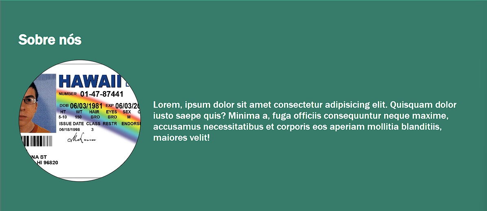

## Semana 1 - Módulo 1 - Lista de Exercícios 4 - Exercício 1 à 6

<h3>Exercício 1</h3>

Usando o último projeto criado na lista de exercício 3 iremos fazer toda a sua estilização. Crie um arquivo CSS a parte e importe ele ao html que foi criado na lista 3, será através desse css que iremos fazer toda a estilização. Primeiro adicione o css reset no início do arquivo para que ele não adicione o espaço de padding.

<h3>Exercício 2</h3>

Vamos começar a estilizar a navbar deixando-a com um display flexível, justify-content: space-around, colocando uma cor de fundo, sombra apenas em baixo (no bottom) e um espaçamento interno de 10px para todos os lados, se necessário mude a cor do texto também.

<h3>Exercício 3</h3>

Para o estilo da primeira sessão iremos adicionar uma cor de fundo diferente da do navbar, um espaçamento interno de 50px em cima e baixo (top e bottom) e 30px nas laterais (left e rigth) e alinhe o texto apenas nesta seção para a esquerda. Além disso, tire o peso da fonte com font-weight: 500 e o comprimento da breve descrição deverá ser de 500px.

<h4>Exercício 4</h4>

Recriar o template disponibilizado:

<a href="https://fmt-lista-4-ex-1a6.vercel.app/">Confira</a>
